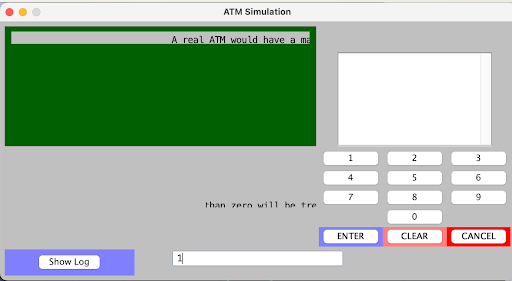
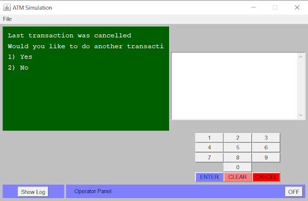
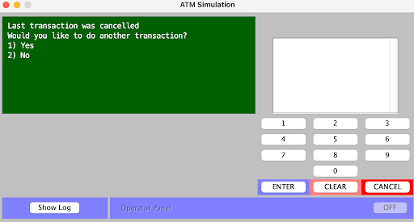

>   **SENG 438 - Software Testing, Reliability, and Quality**

**Lab. Report \#1 – Introduction to Testing and Defect Tracking**

| Group: 2      |
|-----------------|
| Christy                |   
| Gillian              |   
| Halanna               |   
| Shaher                |   

**Table of Contents**

(When you finish writing, update the following list using right click, then
“Update Field”)

[1 Introduction	1](#_Toc439194677)

[2 High-level description of the exploratory testing plan	1](#_Toc439194678)

[3 Comparison of exploratory and manual functional testing	1](#_Toc439194679)

[4 Notes and discussion of the peer reviews of defect reports	1](#_Toc439194680)

[5 How the pair testing was managed and team work/effort was
divided	1](#_Toc439194681)

[6 Difficulties encountered, challenges overcome, and lessons
learned	1](#_Toc439194682)

[7 Comments/feedback on the lab and lab document itself	1](#_Toc439194683)

# Introduction

    Developing effective software practices is crucial to creating a sound product that can be successfully navigated by users, or others who will interact with the product, with ease and efficiency. There are numerous ways to practice good software development, possibly the most important of which being proper testing. Conducting thorough testing on a software application is essential in ensuring it is free of errors that might cause issues for users in the future. There are multiple ways of testing an application, and being exposed to multiple testing methods provides a means of producing effective software. The understanding of software testing going into this lab included only testing actual functions contained in the application code through unit testing. Usually, a test was performed on each coded function for its intended function and some edge cases using a unit test, but testing the actual end-end paths of an application was not consistently carried out. Knowledge of exploratory, regressive, and manual scripted testing was limited other than the understanding that exploratory testing was a less strict testing plan to follow, but not as strict as manual where each test and scenario is written out and to be followed. The following lab report will focus on assessing an ATM machine simulation system and its functions through exploratory, manual scripted, and regression testing. By implementing these different testing approaches, a full examination of the system will be done to determine an analysis on its overall performance and functionality, which contributed to a greater understanding of comprehensive software testing practices.

# High-level description of the exploratory testing plan

  The first stage in testing involved splitting into 2 groups and independently performing exploratory testing on the entire system. The decision was made to take a wide scope, low depth approach to testing in order to check the typical execution of the program. This means attempting to replicate the typical ATM use without considering extreme outlier scenarios. This exploratory testing plan will assess multiple functionalities of the system, but not as extensively as if assessing a specific few functions. The following functions will be tested during the exploratory phase: System login, depositing/withdrawals into both checking and savings, and transfer transactions. The decision was made to ignore the ATM system logs and balance inquiries during this testing because there was still an introductory understanding of the intended functionality of the entire system. Overwhelming the exploratory testing with intricate details of the ATM logs and account balances in every step takes away time to focus on the most basic functionalities of the application. 

# Comparison of exploratory and manual functional testing

  The combination of exploratory testing and manual functional testing ensured a thoroughly tested product, as each one has different benefits. The benefit of manual functional testing is a structured set of rules to follow. There is no subjectivity, it was a simple process. We were given the initial state and the steps to reproduce an outcome, then comparing the expected outcome with the actual outcome. This method helped us understand what the software is truly trying to do with the expected outcome, which leaves very little ambiguity while testing. On the other hand, having a rigid test suite to follow means little freedom to explore other scenarios that might not be in the test suite. Meanwhile, exploratory testing lets you test as you go. Compared to manual testing, where you are looking for specific outcomes, exploratory testing gives you the option to find bugs that would be typically harder to pinpoint. Since there is no strict set of rules while using exploratory testing, it gives a testing perspective that is more similar to a typical user of the software. However, exploratory testing does not provide all the intended functionality of the system under test, so certain operations may get overlooked. Manual scripted testing is effective, as it gives a layout and structure to the testing that follows every use case, but may be time consuming and less efficient. Exploratory testing gives an efficient manner of exploring the application as a regular user would to find important bugs in the basic flow of the product, but may not be as effective for all edge cases. Based on the provided test suite for manual testing, it was discovered that although manual testing gives a more rigid structure to testing and a better guideline to follow, exploratory testing has its own benefits of finding bugs that may not necessarily be found in a developed manual testing plan.

# Notes and discussion of the peer reviews of defect reports

  During exploratory testing, both groups of pair programming used a similar approach of a broad scope, low depth into the functionality of the ATM machine. As such, we expected to potentially obtain some of the same bugs, but also expected to cover a larger functional range of the program in doing so. In actuality, three exploratory bugs were found by both groups, and so we coordinated in reporting them altogether, such as the pervasive bug of the misspelled message upon canceling a transaction. However, most of the bugs we found differed, and as such many of the bugs that would have been found in manual testing had already been identified. The benefit of such a method of testing is as mentioned, the extremely large scope and range of functions that can be covered by only 2 groups testing, while the natural consequence of such is potential repetition and not as effectively testing all edge cases. In reporting all these initial bugs as a group, we were able to develop a framework of reporting bugs to ensure all the important details and steps are covered in recreating the bug. One of the peer reviews at the end of the exploratory testing saw that there were differing ideas about the initial state of the system when reporting a bug. One group reported the initial state from a high-level perspective (System is on/idle, system is/is not servicing a customer), while one group took a more detailed approach (System is displaying a certain page/System is requesting a user enter a password). Upon examination of the SUT cases, it was decided to follow a more in- depth approach to describing the initial state to more closely align with the test suite. There was also a discussion around naming each bug in the defect report. Again, one group took a more high-level approach to the name of the bug while the other was more detailed, but ultimately a mix of the two was used in this case, breaching the gap between both ideas to name the bugs in an effective and concise manner.

# How the pair testing was managed and team work/effort was divided 

  During this lab the pair-testing methodology was used, which was a new experience that was unfamiliar. Being in two groups of two initially, then sharing and analyzing results was an unknown process. It showed the importance of having multiple unbiased tests. Since both groups had their own testing session, one group could not influence the other. As a result, multiple perspectives were evident in the testing plan, which accurately reflects the usage of real software. However, one consequence was the potential for repetition, as both groups tested the system individually, and as such several bugs were reported more than once in the exploratory testing. As such, insights were gained in learning to review bug reports and be aware of its contents, as well as communicate any large bugs with the other group of pair testers so as to avoid repetition and test more of the system as a team. 

  Another teamwork aspect that contributed to the success of the lab was discussing the approach we wanted to take for the exploratory testing. Individually read through the document, and from there proposing what method of testing to proceed with, multiple viewpoints were considered and are evident in the testing plans. After careful consideration, a consensus as a group was reached on how to progress with the assignment. Ensuring everyone is on the same page made progressing with the assignment a smooth and structured process.

# Difficulties encountered, challenges overcome, and lessons learned

  A difficulty encountered in this lab was being able to determine what should be considered a bug and what should not. For example, there was an instance where one of us had an issue where the UI had a display glitch. This was most likely a local machine error, since it could not be replicated or identified, and produced difficulty understanding if this was a real bug or a glitch. This error occurred twice in completely different areas of the application, one of which is shown in Figure 1, and displays the importance of following every step and ensuring that the issue can be replicated.

  
Figure 1: Screen glitch on the transaction page from one tester’s computer.

  Additionally, certain issues presented on some machines and not others, further conflating what should be considered a bug or not. For instance, the misspelling of “Would” on the screen presented after canceling a transaction appeared to be resolved in version 1.1 (Figure 3), but on some machines was still missing an “n” from the end of “transaction” (Figure 2).

  
Figure 2: Version 1.1 being distorted on some machines

  
Figure 3: Version 1.1 being correct on some machines

# Comments/feedback on the lab and lab document itself

  The structure of the lab leaves plenty of room for learning the importance of testing as well as the benefits and drawbacks to each testing method. Although there was some ambiguity of what would be considered a bug if we consider that the functionality of the system was correct (except typos). We learned the general framework for testing a system within a team; how to divide the team so as to increase efficiency, and how to optimize communication within subteams. Additionally, the lab was very useful in learning how to follow up with bugs in different versions of a system, as well as how to write an efficient bug report, and interpret bugs written by different members. Overall the lab was an excellent introduction to software testing and quality. 

